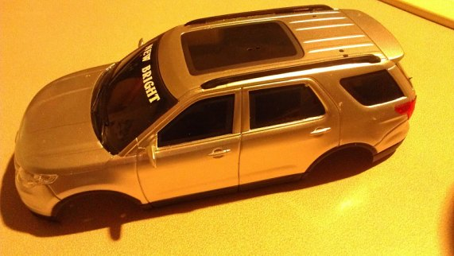
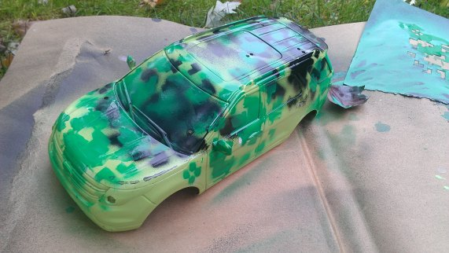

The artwork on our RC car robot was created by my son Jefferson. After we removed the top part of the car, removed the stickers, drilled holes, and sanded it down, he painted it in a [digital camouflage](http://tacticalcamo.com/articles/How-to-Paint-your-weapon-or-marker-digital-style.html) design.

