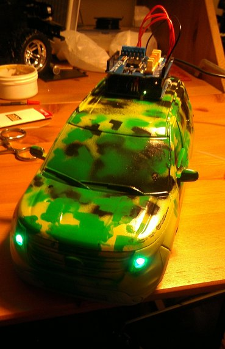

This software project is for controlling an [Arduino](http://arduino.cc/) microcontroller. The hardware is based on an [RC Car to Robot conversion by Randy Sarafan](http://www.instructables.com/id/RC-Car-to-Robot/). While the original hardware description was very useful for me, the original software did not seem to work all that well for my implementation. Not only have I rewritten the software to work more like I anticipated, but I tried to make it more readable by moving most of the boilerplate code to [C++ includes](http://arduino.cc/en/Reference/Include). Also, my implementation was expanded to add [lights](lights.md) (and hopefully some [sound](http://www.arduino.cc/en/Tutorial/PlayMelody) once it is complete). Another cool idea for the future is to [add the guts of an optical mouse](http://www.martijnthe.nl/2009/07/interfacing-an-optical-mouse-sensor-to-your-arduino/) to measure speed, direction, and distance. 

For me, it has not only been an excellent project for learning basic electronics, but it has also been useful for getting my two sons to participate. Through out this project, we incorporated computer science, electronics, math, and [art](CarArt.md).

<table border="1">
<tr><th>Pin</th><th>Use</th></tr>
<tr><td>A0</td><td>Motor Shield - CH A - Current Sensor</td></tr>
<tr><td>A1</td><td>Motor Shield - CH B - Current Sensor</td></tr>
<tr><td><a href="http://www.arduino.cc/en/Tutorial/AnalogInputPins">A2</a></td><td>Green LEDs</td></tr>
<tr><td>D3</td><td>Motor Shield - CH A - PWM</td></tr>
<tr><td>D4</td><td>RGB LED - Common</td></tr>
<tr><td>D5</td><td>RGB LED - Red</td></tr>
<tr><td>D6</td><td>RGB LED - Green</td></tr>
<tr><td>D7</td><td>Ping Sensor</td></tr>
<tr><td>D8</td><td>Motor Shield - CH B - Brake</td></tr>
<tr><td>D9</td><td>Motor Shield - CH A - Brake</td></tr>
<tr><td>D10</td><td>RGB LED - Blue</td></tr>
<tr><td>D11</td><td>Motor Shield - CH B - PWM</td></tr>
<tr><td>D12</td><td>Motor Shield - CH A - Direction</td></tr>
<tr><td>D13</td><td>Motor Shield - CH B - Direction</td></tr>
</table>